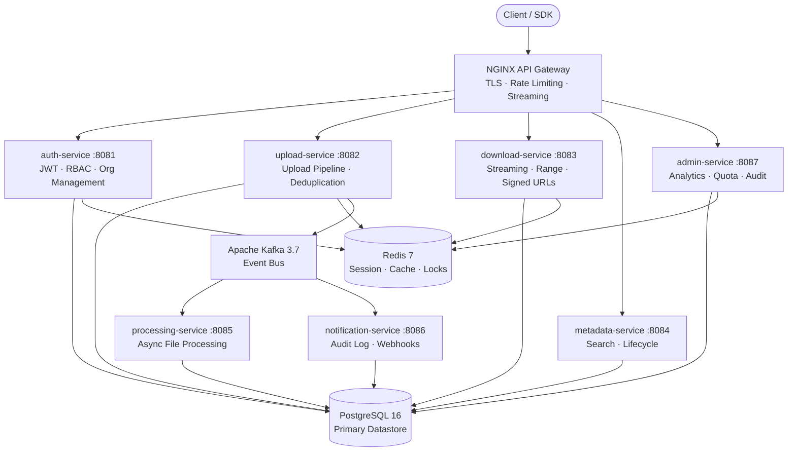
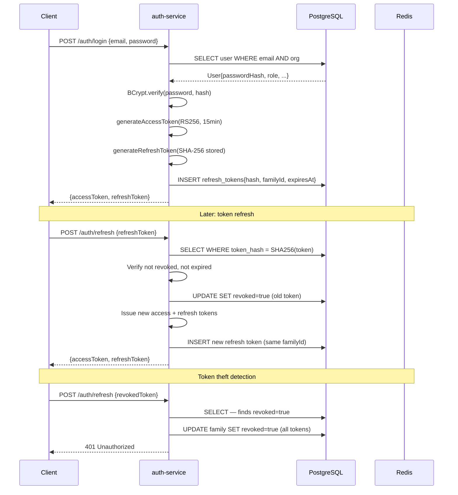
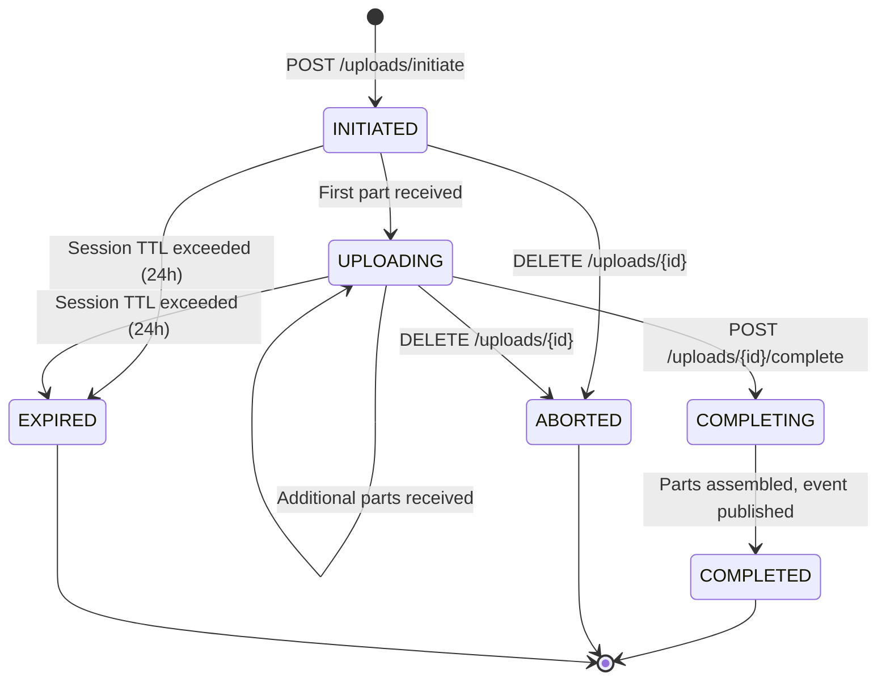
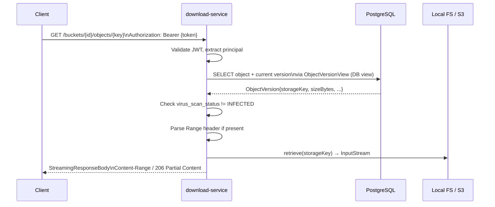
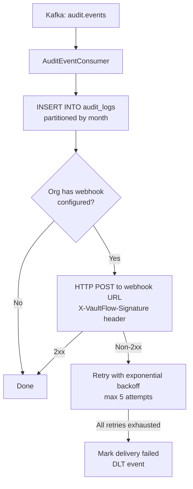
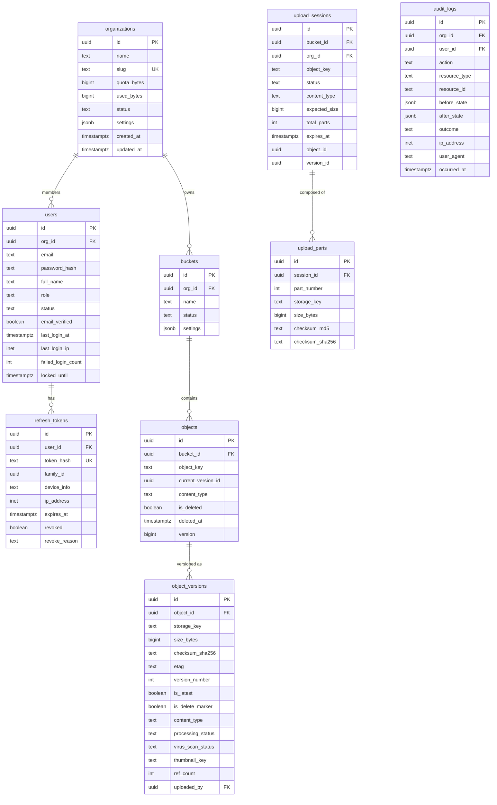
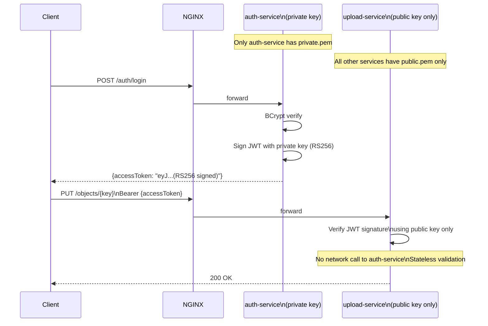
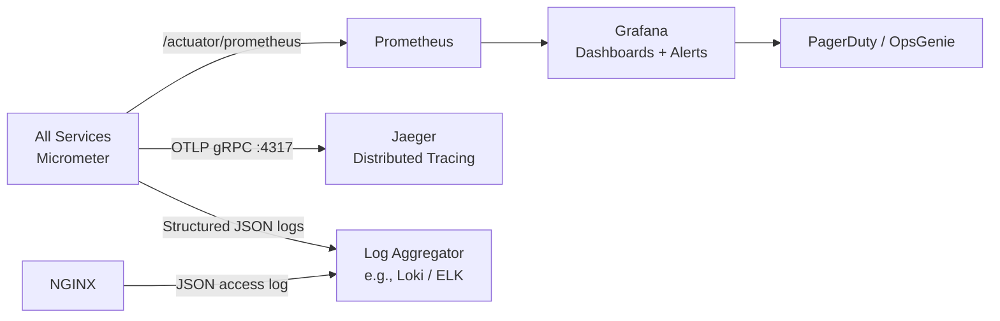

# Architecture

This document describes the system architecture, component design, data model, and key engineering decisions in VaultFlow.

For the reasoning behind specific design choices, see [docs/ENGINEERING_DECISION_RECORDS.md](docs/ENGINEERING_DECISION_RECORDS.md).

---

## System Overview

VaultFlow is a horizontally scalable, multi-tenant object storage platform built as a set of independent microservices. Each service owns its domain, has its own database schema (within a shared PostgreSQL instance for simplicity), and communicates via HTTP for synchronous calls and Apache Kafka for asynchronous event-driven flows.



---

## Component Architecture

### common (Shared Library)

Not a service — a JAR included by all services. Provides:

- **Event schemas**: `FileUploadedEvent`, `FileProcessedEvent`, `AuditEvent` — Kafka message contracts
- **Exception hierarchy**: `VaultFlowException` → `ResourceNotFoundException`, `QuotaExceededException`, `InvalidUploadException`, `ConflictException`, `StorageException`, `VaultFlowAccessDeniedException`
- **`GlobalExceptionHandler`**: Translates exceptions to consistent `ApiErrorResponse` JSON
- **`JwtTokenProvider`**: RS256 JWT validation using public key. Auto-configured via `META-INF/spring/org.springframework.boot.autoconfigure.AutoConfiguration.imports`
- **`VaultFlowUserPrincipal`**: Typed principal record extracted from JWT claims (userId, orgId, email, role)
- **`CorrelationIdFilter`**: MDC propagation for `X-Correlation-ID` across log statements
- **`ChecksumUtil`**: SHA-256 computation + content-addressed path routing (`sha256[0:3]/sha256[3:6]/sha256`)

### auth-service

Single responsibility: issue and validate identity tokens.



Key design: refresh token theft detection via token families. All tokens in a rotation chain share a `family_id`. Presenting a revoked token invalidates every active token in that family.

### upload-service

Handles single-part uploads (≤100 MB) and resumable multipart uploads (up to 5 GB).

**Single-part upload flow:**

```mermaid
flowchart TD
    A[PUT /buckets/{id}/objects/{key}] --> B[QuotaService.assertQuota]
    B --> C[Apache Tika: detect content-type\nmagic bytes, not client header]
    C --> D[ChecksumUtil.sha256Hex]
    D --> E{storage.exists\nstorage_key}
    E -->|No — new content| F[storage.store\nLocalFileSystem / S3]
    E -->|Yes — duplicate| G[Skip write\nincrement ref_count]
    F --> H[INSERT StoredObject\nif not exists]
    G --> H
    H --> I[versionRepository.markAllNotLatest]
    I --> J[INSERT ObjectVersion\nisLatest=true]
    J --> K{is duplicate?}
    K -->|No| L[quotaService.consumeQuota\nincrement used_bytes]
    K -->|Yes| M[Skip quota increment\ndedup saves storage]
    L --> N[Publish FileUploadedEvent to Kafka]
    M --> N
    N --> O[Publish AuditEvent]
    O --> P[Return UploadResponse]
```

**Multipart upload session state:**



Redis distributed lock (`SETNX lock:upload:session:{id}`) prevents duplicate completion if two requests race.

### download-service

**Download request flow:**



Downloads use Spring's `StreamingResponseBody` to pipe the storage `InputStream` directly to the HTTP response writer. No heap buffering — large files are streamed at OS-level speed.

### processing-service

Event-driven Kafka consumer. Processes every uploaded object asynchronously.

```mermaid
flowchart LR
    Kafka[Kafka: file.uploaded] --> Consumer[FileUploadedConsumer\n@KafkaListener]
    Consumer --> Orchestrator[ProcessingOrchestrator]

    Orchestrator --> V[VirusScanProcessor\nalways]
    Orchestrator --> I[ImageThumbnailProcessor\nif image/*]
    Orchestrator --> Vid[VideoThumbnailProcessor\nif video/*]
    Orchestrator --> PDF[PdfPreviewProcessor\nif application/pdf]
    Orchestrator --> M[MetadataExtractionProcessor\nalways]

    V & I & Vid & PDF & M --> Join[CompletableFuture.join\ncollect all results]
    Join --> Persist[ProcessingResultPersistenceService\nUPDATE object_versions]
    Join --> KafkaOut[Publish FileProcessedEvent\nto file.processed]
```

**Key design choices:**

- Processors run in parallel via `Executors.newVirtualThreadPerTaskExecutor()`. A 50 MB video: virus scan (2 s) + thumbnail (1 s) = 2 s total parallel, not 3 s sequential.
- Individual processor failure does not block other processors. Each failure is captured and recorded independently.
- The executor is bounded via Kafka consumer thread count — backpressure naturally flows back to Kafka poll rate.

### notification-service

Consumes `AuditEvent` from Kafka and persists to the `audit_logs` table. Also delivers webhooks with retry.



### admin-service

Read-heavy service providing analytics and management APIs for platform operators.

- Reads directly from PostgreSQL (shared schema)
- Redis caching for expensive aggregation queries (organization overview, upload trends)
- Quota management: `UPDATE organizations SET quota_bytes = ? WHERE id = ?`

---

## Data Model

### Core Schema



### Storage Layout

Object data is stored using SHA-256 content addressing with two-level directory sharding:

```
{STORAGE_BASE_DIR}/
  {sha256[0:3]}/
    {sha256[3:6]}/
      {sha256}              ← actual file bytes
  parts/
    {sessionId}/
      {partNumber}          ← temporary during multipart upload
```

Two-level sharding (`000/000/sha256`) distributes files across ~16 million directory buckets, preventing inode exhaustion on ext4/XFS filesystems that degrade with millions of files in a single directory.

The `storage_key` column in `object_versions` is the SHA-256 hash — both the lookup key and the dedup key. Two `ObjectVersion` rows with the same `storage_key` reference one physical file. `ref_count` tracks how many logical versions point to the same storage key; the file is deleted only when `ref_count` reaches 0.

---

## Kafka Topics

```
topic                       partitions  retention  purpose
─────────────────────────── ────────── ─────────── ──────────────────────────────────────
file.uploaded               16          7 days     Upload notifications → processing-service
file.uploaded.DLT           2           7 days     Failed processing events
file.processed              16          7 days     Processing results → notification-service
file.processing.image       8           7 days     Image processor fan-out
file.processing.video       4           7 days     Video processor fan-out
file.processing.document    4           7 days     PDF processor fan-out
file.processing.virus       8           7 days     Virus scan fan-out
audit.events                8           30 days    Audit events → notification-service
audit.events.DLT            2           30 days    Failed audit events
notification.events         8           7 days     Webhook delivery events
notification.events.DLT     2           7 days     Failed webhook deliveries
```

**Partition key**: `objectId` for file topics (ensures all events for one object go to the same partition, maintaining order). `orgId` for audit events (ensures per-org ordering).

**Consumer groups**:
- `processing-service` consumes `file.uploaded` (scales up to 16 consumers — one per partition)
- `notification-service` consumes `audit.events` (scales up to 8 consumers)

---

## Security Architecture

See [SECURITY.md](SECURITY.md) for the full security model.



---

## NGINX Gateway

NGINX sits in front of all services and handles:

1. **TLS termination** — offloads SSL from JVM services
2. **Rate limiting** — per-IP limits per endpoint type:
   - Auth endpoints: 10 req/s with burst of 20
   - Upload endpoints: 100 req/s with burst of 200
   - Download endpoints: 200 req/s with burst of 500
3. **Streaming I/O** — `proxy_request_buffering off` and `proxy_buffering off` means NGINX does not buffer file bodies in memory. Large uploads/downloads flow directly between client and service at kernel-level speed.
4. **Correlation ID injection** — generates `X-Correlation-ID` if the client does not provide one
5. **Security headers** — HSTS, CSP, `X-Frame-Options`, `X-Content-Type-Options`
6. **Upstream connection pools** — keepalive pools per upstream reduce TCP handshake overhead

---

## Java 21 Virtual Threads

All services run with `spring.threads.virtual.enabled=true`. This replaces Tomcat's OS thread pool with a virtual thread per request, enabling:

- **Upload service**: Each upload request blocks on `IOUtils.toByteArray(stream)` and `storage.store(...)`. With OS threads, 200 concurrent uploads exhaust a typical thread pool. With virtual threads, 50,000 concurrent uploads use 50,000 virtual threads mounted to a small pool of carrier (OS) threads.
- **Processing service**: `Executors.newVirtualThreadPerTaskExecutor()` provides the parallel processor executor. Each processor (virus scan, thumbnail, etc.) can block on I/O independently.

**Constraint**: Avoid `synchronized` blocks in code that runs on virtual threads. Use `ReentrantLock` instead. `synchronized` pins the virtual thread to its carrier thread, negating the concurrency benefit.

---

## Horizontal Scaling

Each service scales independently:

| Service | Scale trigger | Notes |
|---|---|---|
| `upload-service` | CPU > 60% | Shared NFS/EFS mount for object storage; or switch to S3 |
| `download-service` | CPU > 60% | Stateless; scales freely with shared storage |
| `processing-service` | Kafka consumer lag > 5,000 | Max useful replicas = topic partition count (16) |
| `auth-service` | CPU > 60% | Stateless JWT validation; Redis for blacklist |
| `admin-service` | Request rate | Low traffic; usually 1–2 replicas |

The upload and download services share a mounted volume (`vaultflow-object-storage`) in Docker Compose. In Kubernetes, this is a shared PVC (NFS/EFS) or — preferably — the S3 adapter where both services reference the same bucket.

---

## Observability Architecture



- **Metrics**: Micrometer auto-instruments JVM, HTTP requests, Hikari connection pool, Kafka consumer lag. Custom business metrics are registered in service code (`meterRegistry.counter(...)`, `meterRegistry.timer(...)`).
- **Traces**: OpenTelemetry SDK instruments Spring MVC and Kafka. `X-Correlation-ID` is propagated as a trace attribute, enabling correlation between logs and traces.
- **Logs**: All services emit JSON-structured logs to stdout. The `CorrelationIdFilter` injects `X-Correlation-ID` into the MDC, appearing in every log line from that request.

---

## Disaster Recovery

```
PostgreSQL:     Continuous WAL archiving → S3/GCS
                Daily base backup (pg_basebackup)
                Restore: pg_basebackup restore + WAL replay
                RPO: < 5 minutes

Redis:          AOF persistence (fsync=everysec)
                RDB snapshot every 60 seconds
                Redis restart recovers from AOF
                RPO: < 1 second for critical data (sessions);
                     < 60 seconds for cached data

Kafka:          Replication factor ≥ 3 (production)
                7-day message retention
                RPO: 0 (messages are durable)

Object Storage: 3-copy replication (LocalFS with RAID)
                Production: S3 with cross-region replication
                RPO: 0 (S3 11-nines durability)
```

RTO target: < 15 minutes (automated recovery via Kubernetes pod restart + health check).

Full recovery procedures: [docs/RUNBOOK.md](docs/RUNBOOK.md).
